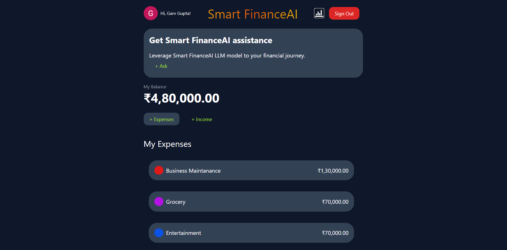

# *Won The KrackHack Hackathon, 1st position*
## *Theme:*
1) AI for Sustainable development goals
2) Intelligent Financial Advisor

### *Problem Statement:*
Many individuals lack access to personalized financial advice and struggle to perform cash flow analysis. Moreover, there is a need for leveraging AI to address sustainable development goals (SDGs) such as financial empowerment  enabling individuals to make sound financial decisions and plans.

### *Solution (Building application for Financial advisory using GPT-3.5 Turbo Model, FAISS, LANGCHAIN, RAG Model, Next.JS with Voice Features)*
Develop an intelligent financial advisor platform that integrates artificial intelligence  to offer personalized financial advice and cash flow analysis to users. This platform will assist users in making informed decisions regarding investments and financial goals, thereby promoting financial empowerment.. This solution aligns with SDGs by addressing the need for financial empowerment to  promote sustainable development.




### Table of Contents
1. [Introduction](#introduction)
2. [Tech Stack](#tech-stack)
3. [Functioning of model](#functioning-of-model)
4. [Features](#features)
5. [Quick Start](#quick-start)
6. [Snippets](#snippets)
7. [Links](#links)
8. [More](#more)

## Introduction
SmartFinanceAI is an open-source AI-powered financial advisory application—an intelligent virtual assistant designed to offer support and information regarding financial matters through natural language conversations.

Harnessing the capabilities of artificial intelligence (AI) and natural language processing (NLP), our goal is to improve the accessibility and efficiency of financial services. We provide a user-friendly interface, guided by prompts, to assist non-technical users in seeking personalized financial information, advice, or assistance.

Developed using Next.js, the application showcases prominent prompt assistance features, including a robust CRUD-based user profile and prompt post functionality. The system leverages a MongoDB database, implements NextAuth authentication, and integrates the LLM Model GPT 3.5  to enhance the functionality of the AI financial advisory platform.

The model is sourced from Hugging Face, utilizing their token for secure authorization. Additionally, we employ RAG (Retrieval Augmented Generation) to enhance prompt responses, combining our dataset with outputs generated by the LLM Model for optimal results.
Using Voice Assistace message you can get your advise and can get summary of the advise  through voice if you aree in hurry to get your advise.

## Tech Stack
-**LLM Model** -GPT 3.5
- **Language**: Python, JavaScript
- **Libraries**: Hugging Face Transformers,Speech_recognition,pyttsx3,Pyaudio,openai,
- **Text Embeddings and Vector Search**: LangChain Community,sentence-transformers/all-MiniLM-L6-v2
- **Summarizer model**: BartTokenizer, BartForConditionalGeneration, facebook/bart-large-cnn
- **Search Engine**: FAISS (Facebook AI Similarity Search)
- **Natural Language Understanding and Generation**: RAG (Retrieval-Augmented Generation)
- **Model Loading and Interaction**: Hugging Face Model Hub
- **Web Framework**: FastAPI,Next.js,TailwindCSS
- **DataBase**: firebase,firestore,fireauth
- **Authentication**: NextAuth

## Functioning of model
*Data Information*
   - The data consists of 9 books
   1) TRACTION : GET A GRIP ON YOUR BUSINESS - GINO	WICKMAN
   2) Rich Dad Poor dad
   3) The Intelligent Investor - BENJAMIN GRAHAM
   4) The Millionaire Next Door ( Thomas J. Stanley & William D. Danko, 1998)
   5) The Total Money Makeover - Dave Ramsey
   6) The-Little-Book-of-Common-Sense-Investing
   7) The-Psychology-of-Money
   8) Thinking-Fast-and-Slow
   9) I Will Teach You To Be Rich - Ramit Sethi
   
**Loading the document and splitting text:**
   - Loading the pdf file using PyPDFLoader and extracted text from the pdf 
   - Splitting the text into smaller chunks using langchain.text_splitter

**Text Embeddings:**
   - Text embeddings are generated using the `HuggingFaceEmbeddings` class from `langchain_community.embeddings`.
   - The model used for embedding is 'sentence-transformers/all-MiniLM-L6-v2', and it is configured to run on the CPU.

**Converting to vectors and saving it**
   - Converted text to vector using FAISS class from langchain_community.vectorstores and then saving the data

# **Creating a RAG Using LangChain and FAISS**
- It creates a retriever using a vector store (`db1`). The retriever is configured for similarity search, enabling the retrieval of documents similar to a given query.

- Checking our vector database and see if it can retrieve similar chunks of content giving some prompt
- It is basically fetching the output of the prompt from the vector database only

# **Building an LLM Chain for Question-Answering**
- Fetching the api token from Open Ai and loading model from hugging face 
- Generaing prompt templates and then creating llm chain for answering of our prompt.

# **Creating a RAG Chain**
Creating a rag chain so that the model has context to the query/prompt
- A retriever is created from the vector store db1 using the as_retriever method.
- The retriever is configured for similarity search, aiming to retrieve the top 20 documents similar to a given query.
- A RAG (Retrieval-Augmented Generation) chain is constructed using the rag_chain variable.
- The chain includes a retriever for providing context and a language model chain (llm_chain) for generating responses.
- The RAG chain is invoked with a specific query ("I want to start investing, give me some tips").
- The retriever in the chain fetches relevant documents based on similarity to the query.
- The language model chain (llm_chain) then generates responses based on the retrieved context and the given question.
**Speech Recognition**
The inclusion of speech recognition capabilities enhances user interaction. Users can communicate with the chatbot through voice commands, making the platform more accessible.
**Text Summarizers for Concise Information**
To deliver information effectively, text summarizers are employed. Users can receive concise summaries of financial advice, making the content easily digestible.


## Key Features
++-**Modern Design with Glassmorphism Trend Style**
Embrace a contemporary and visually captivating design that follows the glassmorphism trend, providing a sleek and stylish appearance.

**Dashboard**
Financial Analytics: Personalize your spending habits by adding specific categories to monitor your income, facilitating efficient income management. Easily explore your expenditure patterns on our user-friendly dashboard for a comprehensive financial overview.

Income Sources: Seamlessly integrate your income accounts and trace sources for meticulous financial tracking. Obtain insights into your financial inflow by documenting income details from diverse sources.

Voice Assistance: Effortlessly receive personalized financial advice through our voice assistance feature.

**AI-Enabled Financial Advisor**
Benefit from response generation by our advanced model, RAG chain, developed in-house using LangChain and FAISS for effective Question-Answering.

**Profile Page**
Each user receives a dedicated profile page, showcasing all their expenditures and providing an overview of their expenses powered with graphical analytics and visual representation using React-chart.js.

**Google Authentication using FirebaseAuth**
Enable secure Google authentication using FirebaseAuth, ensuring a streamlined and trustworthy login experience.

**Responsive Website**
Develop a fully responsive website to ensure an optimal user experience across various devices, from desktops to smartphones.

**Code Architecture and Reusability**
Implement best practices for code architecture and reusability, enhancing maintainability and scalability.

**Quick Start**
Follow these steps to set up the project locally on your machine.

### Prerequisites
Make sure you have the following installed on your machine:
- [Git](https://git-scm.com/)
- [Node.js](https://nodejs.org/en)
- [npm](https://www.npmjs.com/) (Node Package Manager)

### Cloning the Repository
```bash
git clone https://github.com/adrianhajdin/project_next_13_ai_prompt_sharing.git
cd project_next_13_ai_prompt_sharing

**Installation**

Install the project dependencies using npm:

```bash
npm install
```
Install the model packages from requirement.txt after changing directory to backend:

```bash
pip install -r requirements.txt
```

**Set Up Environment Variables**
Login into your firebase account and replace all the credential with your firebase keys in firebase file.
**Running the Project**

Open the `backend folder`, then run all the `model.ipynb` notebook to launch the server to fetch the model on feed.

```bash
npm run dev
```

Open [http://localhost:3000](http://localhost:3000) in your browser to view the project.

